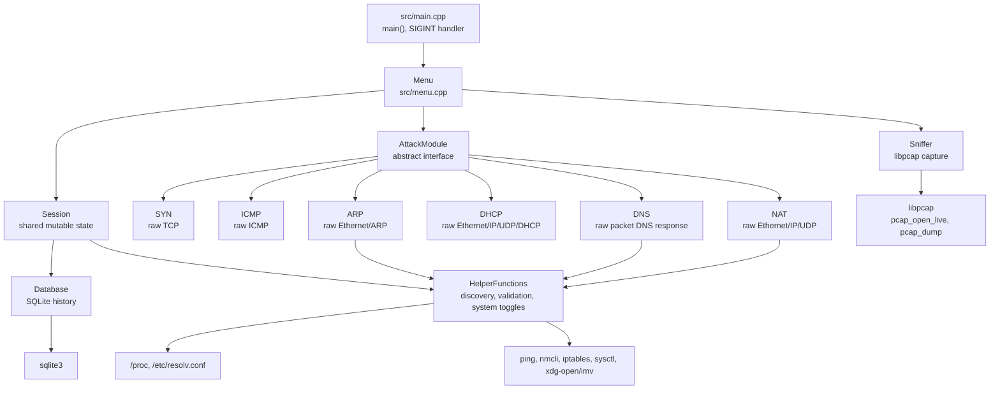
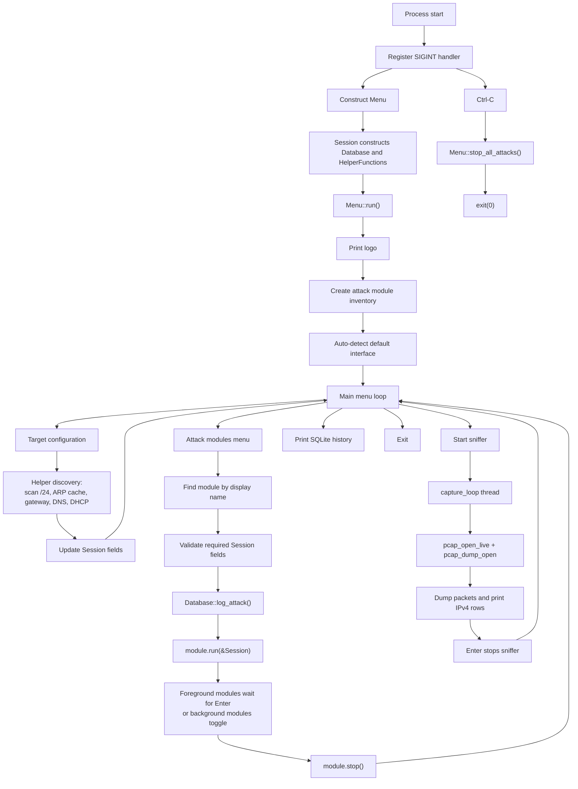
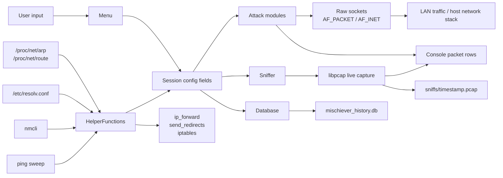

# Mischiever Architecture

This document diagrams the architecture verified from the current source code. The design is small and centered on `Menu` plus shared `Session`; the protocol modules are plugged in through `AttackModule`, but the menu still has substantial module-specific knowledge.

## High-Level Module Graph

Notes:

- `Menu` is the application hub and owns almost every top-level object.
- `Session` carries both configuration data and shared service objects.
- `AttackModule` gives the modules a common shape, but the menu still selects modules by matching `get_name()` strings.
- `HelperFunctions` is a mix of pure-ish validators, system discovery, shell command execution, and privileged network toggles.

## Runtime Flow Graph

Notes:

- Most user interactions are blocking `std::cin` reads.
- Foreground attack modules run until the user presses Enter.
- ARP spoofing and DHCP starvation are toggled in the menu and can keep running in the background.
- SIGINT cleanup only stops attack modules; it does not explicitly stop the sniffer.

## Data Flow Graph

Notes:

- `Session` is the only real shared application state model.
- Packet-generation modules mostly read from `Session` at start, then copy strings into worker threads.
- The database records only a small slice of runtime context.
- System state changes are side effects of helper methods and module stop methods, not first-class tracked resources.

## Control-Flow Hotspots

- `Menu::show_floods_menu()` has a NAT-specific hack that temporarily sets `session.target_ip = session.gateway_ip`.
- `Menu::show_mitm_menu()` manually maintains `session.arp_spoof_active`.
- `Menu::show_dos_menu()` manually maintains `session.dhcp_starvation_active` and gates DNS spoofing on ARP spoofing.
- `Menu::set_target_config()` contains discovery, validation, prompting, and state mutation in one long method.
- `Menu::run_selected_attack()` assumes an attack can be started, then stopped by pressing Enter. Background/toggle modules bypass parts of this generic lifecycle.

## System-State Side Effects

```mermaid
flowchart TD
    ARPSpoof["ARP Spoof mode"] --> EnableForward["ip_forward = 1"]
    ARPSpoof --> DisableRedirects["send_redirects = 0"]
    ARPStop["ARP stop"] --> DisableForward["ip_forward = 0"]
    ARPStop --> EnableRedirects["send_redirects = 1"]

    ARPBlackhole["ARP Blackhole mode"] --> ForwardDrop["iptables -P FORWARD DROP"]
    BlackholeStop["Blackhole stop"] --> ForwardAccept["iptables -P FORWARD ACCEPT"]

    DNSSpoof["DNS Spoofing start"] --> DropDNS["iptables -I FORWARD -p udp --dport 53 -j DROP"]
    DNSStop["DNS stop"] --> RemoveDropDNS["iptables -D matching DROP rule"]

    SnifferStart["Sniffer start"] --> SniffsDir["mkdir -p sniffs"]
    SnifferCapture["Sniffer capture"] --> ChownPcap["optional chown to SUDO_UID/SUDO_GID"]
```

Notes:

- These side effects are global to the host, not scoped to Mischiever's process.
- The most dangerous design issue is changing default firewall policy (`iptables -P FORWARD DROP/ACCEPT`) rather than installing scoped, reversible rules.
- Future refactors should wrap these mutations in explicit guard/restore objects and record the previous state before changing it.
